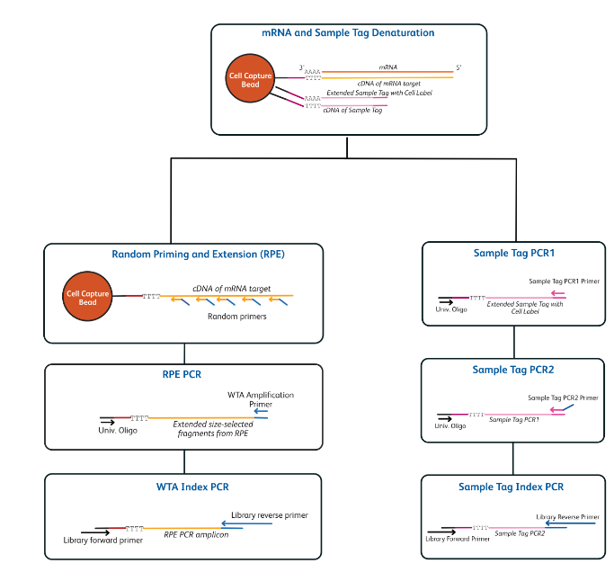
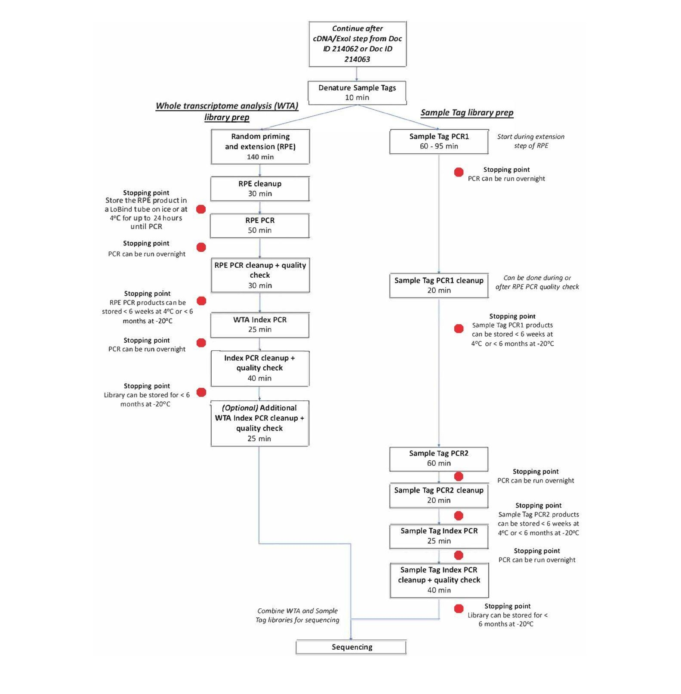
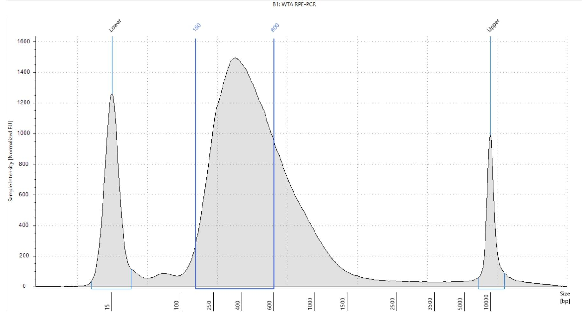
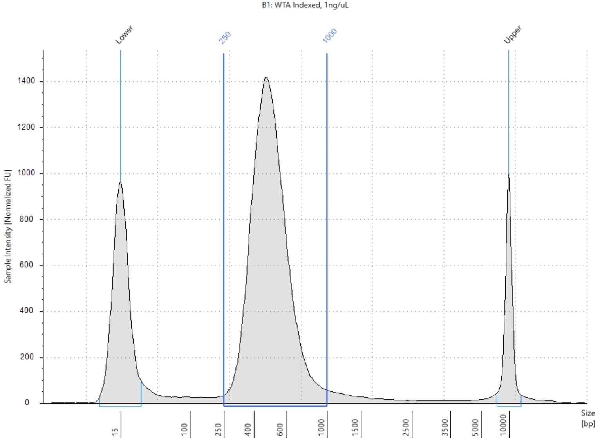
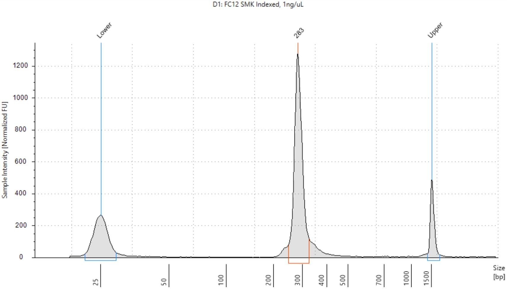

<table>
<colgroup>
<col style="width: 100%" />
</colgroup>
<thead>
<tr class="header">
<th><h1 id="module-2-single-cell-library-preparation-and-sequencing"><strong>Module 2: Single-Cell Library Preparation and Sequencing</strong></h1></th>
</tr>
</thead>
<tbody>
</tbody>
</table>

## 

## **1. mRNA Whole Transcriptome Analysis (WTA) & Sample Tag Library Preparation Protocol**

**1.1 Introduction:**

**Figure 2:** Showing workflow of mRNA Whole Transcriptome Analysis (WTA) & Sample Tag Library Preparation

After single-cell capture on the BD Rhapsody Single Cell Analysis System or the BD Rhapsody Express single-cell analysis system, we create single-cell whole transcriptome mRNA and sample tag libraries for sequencing. In the enhancement cell, the Capturer bead cDNA from mRNA is already encoded, and at the same time, barcode information is also added to the sample tag during reverse transcription, which enables amplification of the sample tag solution.

In preparation for sample tag sequencing libraries, first we denature the extended sample tag from BD Rhapsody Enhancement Cell Capture beads, and later it is amplified through a series of PCR steps. While using a random priming approach, the whole transcriptome amplification (WTA) library is prepared directly from BD Rhapsody Enhancement Cell Capture beads, followed by index PCR. Both the whole transcriptome mRNA and the Sample Tag libraries can be combined for sequencing.

**1.2 Time consideration**

**1.3 Performing random priming and extension (RPE) on BD Rhapsody Enhanced Cell Capture Beads with cDNA:**

This section outlines the procedure for generating random priming products. Initially, sample tags containing barcode sequences are released from the BD Rhapsody™ Enhanced Cell Capture Beads by denaturation and retained for subsequent sample tag amplification. Random primers are then annealed to the bead-bound cDNA and extended using an enzymatic reaction. To enhance assay sensitivity, the primer hybridization and extension steps are performed twice.

In this protocol, initial cell inputs should be between 1000 to 20000 single cells for whole transcription amplification library preparation.

1.  Set a heat block to 95°C, one thermomixer to 37°C, and one thermomixer to 25°C.

2.  In a new 1.5-mL LoBind® tube, pipet the following reagents

**Random priming mix**

| **S.No.**              | **Reagents**          | **For one library with 10% overage (μL)** |
|------------------------|-----------------------|-------------------------------------------|
| **1**                  | WTA Extension Buffer  | 22                                        |
| **2**                  | WTA extension Primers | 22                                        |
| **3**                  | Nuclease-Free Water   | 147.4                                     |
|                        | **Total**             | 191.4                                     |

3.  Resuspend the exonuclease I-treated capture beads with a pipet.

4.  Place the tube of exonuclease I-treated beads in a bead resuspension buffer on the 1.5 ml magnet for \<2 minutes. Remove the supernatant.

5.  Remove the tube from the magnet and resuspend the bead in 75 μL of elution buffer. Pipet-mix 10 times to resuspend the beads.

6.  Place the tube with beads in a 95°C heat block for 5 minutes (**no** **shaking**).

7.  Label a new 1.5-ml tube as sample tag products.

8.  Briefly centrifuge the tube, and place the tube on a magnet for \<2 min. Remove the supernatant and transfer it to the Sample Tag products tube.

9.  Remove the tube from the magnet. Pipet 200 μL of elution buffer into the tube. Pipet-mix 10X to resuspend the beads.

10. Briefly centrifuge the tube, then place the tube on a magnet for less than 2 min. Remove and dispose of the supernatant.

11. Remove the tube with the beads from the magnet, and Pipet 174 μL of random primer mix into the tube. Pipet-mix 10 times to resuspend beads. Save the remaining volume of Random Primer Mix for a second RPE. Keep the random primer mix at RT.

12. Incubate the tube in the following order:

- 95°C in a heat block (no shaking) for 5 minutes.

- Thermomixer at 1,200 rpm and at 37°C for 5 minutes.

- Thermomixer at 1,200 rpm and at 25°C for 5 minutes.

13. Briefly centrifuge the tube and keep it at RT.

14. In a new 1.5 ml LoBind tube, pipet the following reagents:

>**Primer extension enzyme mix:**

| **Sr. No.** | **Reagent**          | **For 1 library with 10 percent overage (μL)** |
|-------------|----------------------|------------------------------------------------|
| **1**       | 10 nM dNTP           | 8.8                                            |
| **2**       | Bead RT/PCR Enhancer | 13.2                                           |
| **3**       | WTA Extension Enzyme | 6.6                                            |
|             | **Total**            | 28.6                                           |

15. Pipet 26 μL of the extension enzyme and mix it into the sample tube containing the beads (for a total volume of 200 μL).

16. Program the Thermomixer, then place the tube in it.

    - At 1200 and at 25°C for 10 minutes.

    - At 1200 and at 37°C for 15 minutes.

    - At 1200 and at 45°C for 10 minutes

    - At 1200 and at 55°C for 10 minutes

**IMPORTANT:** Confirm “Time Mode” is set to “Time Control” before the program begins.

While the thermomixer program is running, **begin Sample Tag PCR1**. See the Performing Sample Tag PCR1 steps below:

17. Place the tube in a 1.5-mL tube magnet and remove the supernatant.

18. Remove the tube from the magnet and resuspend the beads in 205 μL of elution buffer.

19. To denature the random priming products off the beads, pipet to resuspend the beads.

20. Then incubate the sample at 95°C in a heat block for 5 minutes (no shaking).

21. Place the tube in a thermomixer for 10 seconds at 1,200 rpm to resuspend the beads.

22. Place the tube in a 1.5-mL tube magnet. Immediately transfer 200 μL of the supernatant containing the RPE product to a new 1.5-mL LoBind tube.

23. Pipet 200 μL of cold Bead Resuspension Buffer to the tube with leftover beads. Gently re-suspend the beads by pipet-mixing only. Stored the beads at 4°C upto 3 months. Immediately continue to purify RPE products.

**1.4 Performing Sample Tag PCR1:**

**Prepare Sample Tag PCR1 master mix**

| **S.No.** | **Reagent**             | **For one library with 10% overage (μL)** |
|-----------|-------------------------|-------------------------------------------|
| **1**     | PCR master mix          | 110                                       |
| **2**     | Universal Oligo         | 22                                        |
| **3**     | Sample tag PCR1 primers | 1.1                                       |
| **4**     | Nuclease-free water     | 13.2                                      |
|           | Total                   | 146.3                                     |

1.  In the new 1.5 ml tube, add 133 μL of sample tag PCR1 master mix and 67 μL of sample tag product and pipet mix.

2.  Pipet 50 μL of the sample tag reaction into each of the 0.2 ml PCR tubes.

Place these tubes in preset PCR cycles as mentioned below:

| **Steps**                                                                                       | **Cycle** | **Temperature** | **Time** |
|-------------------------------------------------------------------------------------------------|-----------|-----------------|----------|
| **Hot start**                                                                                   | 1         | 95°C            | 3 min.   |
| **Denaturation**                                                                                | 12\*      | 95°C            | 30 s     |
| **Annealing**                                                                                   |           | 60°C            | 3 min    |
| **Extension**                                                                                   |           | 72°C            | 1 min    |
| **Final extension**                                                                             | 1         | 72°C            | 5 min    |
| **Hold**                                                                                        | 1         | 4°C             |          |
| \*The suggested PCR cycle might need to be optimized for different cell types and cell numbers. |           |                 |          |

**1.5 Purifying RPE product:**

In this section, it is described how to perform a single-sided AMPure cleanup to remove primer dimers and other small molecular weight by-products. The final product is purified single-stranded DNA.

1.  Add 360 μL of AMPure XP magnetic bead (RT) in a tube containing 200 μL of RPE product supernatant. Pipet, mix, and centrifuge briefly, and incubate the suspension at RT for 10 minutes.

2.  Place the suspension on a magnetic stand for 5 minutes and remove the supernatant.

3.  Keep the tube on a magnetic stand and add freshly prepared 80% ethyl alcohol to the tube. Incubate for 30s, and remove the supernatant. Repeat this wash for a total of two washes.

4.  Air-dry the beads at RT until no longer glossy (~15-20 minutes).

5.  Remove the tube from the magnetic stand and resuspend the beads in 40 μL of elution buffer.

6.  Incubate the sample at RT for 2 minutes and briefly centrifuge the tube.

7.  Place the tube on a magnet until the solution is clear and pipet the eluate (~40 μL) to a new PCR tube.

**1.6 Performing RPE PCR:**

1.  Prepare the following PCR master mix in a 1.5 ml tube

**RPE PCR mix**

| **Sr. No.** | **Reagent**              | **For 1 library with 10 % overage (μL)** |
|-------------|--------------------------|------------------------------------------|
| **1**       | PCR master Mix           | 66                                       |
| **2**       | Universal Oligo          | 11                                       |
| **3**       | WTA amplification Primer | 11                                       |
|             | Total                    | 88                                       |

2.  Add 80 μL of PCR master mix into 40 μL of purified RPE product and Pipet mix

3.  Split the RPE reaction into two PCR tubes with 60 μL in each tube.

4.  Place these tubes in the preset PCR program as follows:

| **Step**                                                                                        | **Cycle** | **Temperature** | **Time** |
|-------------------------------------------------------------------------------------------------|-----------|-----------------|----------|
| **Hot start**                                                                                   | 1         | 95°C            | 3 min.   |
| **Denaturation**                                                                                | 12\*      | 95°C            | 30 s     |
| **Annealing**                                                                                   |           | 60°C            | 3 min    |
| **Extension**                                                                                   |           | 72°C            | 1 min    |
| **Final extension**                                                                             | 1         | 72°C            | 5 min    |
| **Hold**                                                                                        | 1         | 4 C             | Infinite |
| \*The suggested PCR cycle might need to be optimized for different cell types and cell numbers. |           |                 |          |

**1.7 Purification of the RPE PCR amplification product (single-sided cleanup):**

This section describes how to perform a single-sided AMPure cleanup to remove unwanted small molecular weight products from the RPE products. The final product is purified double-stranded DNA (~200–2,000 bp).

1.  Combine the two RPE PCR reactions into a new 1.5-mL tube.

2.  Briefly centrifuge the tubes with the RPE PCR product.

> ***IMPORTANT:** It is critical for the final volume to be exactly 120 μL to achieve the appropriate size selection of the purified RPE PCR product. If the volume is \< 120 uL, bring the volume to 120 uL with an elution buffer.*

3.  Pipet 120 μL of AMPure XP magnetic beads (RT) into the tube containing 120 μL of RPE PCR product. Pipet-mix at least 10 times, then briefly centrifuge the samples.

4.  Incubate the suspension at RT for 5 minutes.

5.  Place the suspension on the tube magnet for 3 minutes. Discard the supernatant.

6.  Keeping the tubes on the magnet, gently pipet 500 μL of fresh 80% ethyl alcohol into the tube.

7.  Incubate the samples for 30 seconds on the magnet. Remove the supernatant.

8.  Repeat the 80% ethyl alcohol wash for a total of two washes.

9.  Keeping the tubes on the magnet, use a small-volume Pipet to remove any residual supernatant from the tube.

10. Air-dry the beads at RT for 5 minutes or until the beads no longer look glossy.

11. Remove the tube from the magnet and pipet 40 μL of the elution buffer into the tube. Pipet-mix the suspension at least 10 times until beads are fully suspended.

12. Incubate the samples at RT for 2 minutes. Briefly centrifuge the tubes to collect the contents at the bottom.

13. Place the tubes on the magnet until the solution is clear, usually ~30 seconds.

14. Pipet the eluate (~40 μL) into new 1.5-mL LoBind tubes. The RPE PCR product is ready for Index PCR.

**Figure 3:** Tapestation profile of purified RPE PCR products.

**1.8 Purifying Sample Tag PCR1 products:**

This section describes how to perform a single-sided AMPure cleanup to remove primer dimers from the Sample Tag PCR1 products. The final product is purified double-stranded DNA.

1.  In a new 5.0-mL LoBind tube, prepare 5 mL of fresh 80% ethyl alcohol by combining 4.0 mL absolute ethyl alcohol, molecular biology grade, with 1.0 mL of NFW. Vortex the tube for 10 seconds to mix. Make fresh 80% ethanol and use it within 24 hours.

2.  Bring the AMPure XP magnetic beads to RT. Vortex at high speed for 1 minute until the beads are fully resuspended.

3.  Pipet **360 μL** AMPure XP beads into a tube with 200 μL Sample Tag PCR1. Pipet-mix 10 times.

4.  Incubate at RT for 5 minutes.

5.  Place the 1.5 mL LoBind® tube on the magnet for 5 minutes. Remove the supernatant.

6.  Keeping the tube on the magnet, gently add 500 μL of fresh 80% ethyl alcohol and incubate for 30 seconds. Remove the supernatant.

7.  Repeat step 5 once for two washes.

8.  Keeping the tube on the magnet, use a small-volume Pipet to remove and discard the residual supernatant from the tube.

9.  Air-dry the beads at RT for 5 minutes.

10. Remove the tube from the magnet and resuspend the bead pellet in **30 μL** of elution buffer. Vigorously pipet-mix until the beads are uniformly dispersed. Small clumps do not affect the performance.

11. Incubate at RT for 2 minutes, then briefly centrifuge.

12. Place the tube on the magnet until the solution is clear, usually for 30 seconds.

13. Pipet the eluate (~30 μL) into a new 1.5-mL LoBind® tube (purified Sample Tag PCR1 products).

**STOPPING POINT:** Store at 2°C to 8°C before proceeding in 24 hours or at –25°C to –15°C for up to 6 months.

**1.9 Performing WTA Index PCR**

This section describes how to generate mRNA libraries compatible with the Illumina sequencing platform by adding full-length Illumina sequencing adapters and indices through PCR. For cell capture samples from multiple cartridges, the same reverse primer can be used to label all the library types from one cartridge (for example, WTA and SMK from cartridge 1 can both be given reverse primer 1, while WTA and SMK from cartridge 2 can be labelled with reverse primer 2, and so on). The kit provides ***4 indexing primers*** and can label all sample combinations from up to 4 cartridges for the same sequencing run.

**Dilute the RPE PCR products with Elution Buffer such that the concentration of the 150–600 bp peak is 2 nM. If the product concentration is \<2 nM, do not dilute and continue.**

For example, if the Tapestation measurement of the 150–600 bp peak is 6 nM, then dilute the sample threefold with Elution Buffer to 2 nM.

1.  In a new 1.5-mL tube, pipet the following components:

**WTA index PCR mix**

| **S.No.**  | **Kit Component**             | **For library 1, With 10% overage (μL)** |
|------------|-------------------------------|------------------------------------------|
| **1**      | PCR MasterMix                 | 27.5                                     |
| **2**      | Library Forward Primer        | 5.5                                      |
| **3**      | \*Library Reverse Primer(1-4) | 5.5                                      |
| **4**      | Nuclease-Free water           | 5.5                                      |
|            | **Total**                     | 44                                       |
| \*For more than one library, use different library Reverse Primers for each library   |

2.  Gently vortex mix, briefly centrifuge, and place back on ice.

3.  In a new 0.2-mL PCR tube, combine 40 μL of WTA Index PCR Mix with 10 μL of 2 nM of RPE PCR products. Pipet-mix 10 times.

Run the following PCR program:

| **Steps**           | **Cycle** | **Temperature** | **Time** |
|---------------------|-----------|-----------------|----------|
| **Hot Start**       | 1         | 95              | 3 min.   |
| **Denaturation**    | 8-9\*     | 95              | 30 s     |
| **Annealing**       |           | 60              | 30 s     |
| **Extension**       |           | 72              | 30 s     |
| **Final extension** | 1         | 72              | 1 min    |
| **Hold**            | 1         | 4               | infinite |

\*Depending on the concentration of diluted RPE PCR products

**1.10 Purification of the WTA Index PCR product** **(dual-sided cleanup)**

Double-sided AMPure cleanup to ensure that the library is at a proper size (~250–1,000 bp) for Illumina sequencing

1.  Add **60 μL** of nuclease-free water to the WTA Index PCR product for a final volume of 110 μL.

2.  Transfer 100 μL of WTA Index PCR product into a new 0.2-mL PCR tube.

3.  Add **60 μL** of AMPure XP magnetic beads to the 0.2-mL PCR tube Pipet-mix and centrifuge.

4.  Incubate the suspensions at RT for 5 minutes, then place on the 0.2-mL strip tube magnet for 2 minutes.

5.  Pipet **15 μL** of AMPure XP magnetic beads into a different strip tube.

6.  While the strip tube in step 6 is still on the magnet, carefully, without disturbing the beads, remove and transfer the **160 μL** of supernatant into the 0.2-mL strip tube with AMPure XP magnetic beads (from step 5) and pipet-mix 10 times.

7.  Incubate the suspension at RT for 5 minutes, then place the new tube on a 0.2-mL tube magnet for 1 minute.

8.  While on the magnet, carefully remove and appropriately discard only the supernatant without disturbing the AMPure XP magnetic beads.

9.  Keeping the tubes on the magnet, gently pipet 200 μL of fresh 80% ethyl alcohol into the tubes.

10. Incubate the samples for 30 seconds on the magnet.

11. While on the magnet, carefully remove and appropriately discard only the supernatant without disturbing the AMPure XP magnetic beads. Repeat the ethyl alcohol wash for a total of two washes.

12. Keeping the tubes on the magnet, use a small-volume pipette to remove any residual supernatant from the tube.

13. Leave the tubes open on the magnet to dry the AMPure XP magnetic beads at RT for ~1 minute. Do not over-dry the AMPure XP magnetic beads.

14. Remove the tube from the magnet and pipet 30 μL of elution buffer into the tubes and pipet-mix to completely resuspend the AMPure XP magnetic beads.

15. Incubate the samples at RT for 2 minutes.

16. Place the tubes on the magnet until the solution is clear, usually ~30 seconds.

17. Pipet the eluate (~30 μL) into new 1.5-mL LoBind tubes. The WTA Index PCR eluate is the final sequencing library.

18. Quantify and perform quality control of the Index PCR libraries with a Qubit Fluorometer using the Qubit dsDNA HS Assay and Agilent 4200 TapeStation system using the Agilent High Sensitivity D1000 or D5000 ScreenTape Assay

**Figure 4:** Tapestation profile of purified WTA Index PCR product.

**1.11 Performing Sample Tag PCR2 on the Sample Tag PCR1 products**

This section describes how to amplify Sample Tag products through PCR. The PCR primers include partial Illumina sequencing adapters that enable the addition of full-length Illumina sequencing indices in the next PCR.

1.  In the pre-amplification workspace, pipet reagents into a new 1.5 mL LoBind® tube on ice:

**Sample tag PCR2 reaction mix**

| **S. No.** | **Reagent**            | **For 1 library with 10% overage (μL)** |
|------------|------------------------|-----------------------------------------|
| **1**      | PCR Master mix         | 27.5                                    |
| **2**      | Universal Oligo        | 2.2                                     |
| **3**      | Sample Tag PCR2 Primer | 3.3                                     |
| **4**      | Nuclease-Free Water    | 16.5                                    |
|            | **Total**              | 49.5                                    |

2.  Bring the PCR2 reaction mix to the post-amplification workspace.

3.  Pipet 5.0 μL of PCR1 products into 45 μL Sample Tag PCR2 reaction mix and mix.

> Program the thermal cycler. Do not use fast cycling mode.
>
> \*Cycle number might require optimisation according to cell number type

**1.12 Purifying Sample Tag PCR2 products:**This section describes how to perform a single-sided AMPure cleanup to remove primer dimers from the SampleTag PCR2 products. The final product is purified double-stranded DNA.

1.  To 50.0 μL of PCR2 products, pipet 60 μL of AMPure beads (RT).

2.  Pipet-mix 10 times and incubate at RT for 5 minutes.

| **Steps**           | **Cycle** | **Temperature** | **Time** |
|---------------------|-----------|-----------------|----------|
| **Hot Start**       | 1         | 95              | 3 min    |
| **Denaturation**    | 10\*      | 95              | 30 s     |
| **Annealing**       |           | 60              | 30 s     |
| **Extension**       |           | 72              | 30 s     |
| **Final extension** | 1         | 72              | 1 min    |
| **Hold**            | 1         | 4               | infinite |

3.  Place each tube on the strip tube magnet for 3 minutes. Remove the supernatant.

4.  Keeping the tubes on the magnet, gently add 200 μL of fresh 80% ethyl alcohol into each tube and incubate for 30 seconds. Remove the supernatant.

5.  Repeat step 4 for a total of two washes.

6.  Keeping the tube on the magnet, use a small-volume Pipet to remove and discard the residual supernatant from the tube.

7.  Air-dry the beads at RT for 3 minutes.

8.  Remove the tube from the magnet and resuspend each bead pellet in 30 μL of elution buffer. Pipet-mix until the beads are fully resuspended.

9.  Incubate at RT for 2 minutes and briefly centrifuge.

10. Place the tube on the magnet until the solution is clear, usually 30 seconds.

11. Pipet the entire eluate (~30 μL) to new 1.5-mL LoBind® tubes (purified Sample Tag PCR2 products).

12. Estimate the concentration with a Qubit Fluorometer using the Qubit dsDNA HS Assay Kit. Follow the manufacturer’s instructions.

13. Dilute an aliquot of the products with Elution Buffer to 0.1-1.1 ng/μL.

**1.13 Performing Sample Tag Index PCR:**

This section describes how to generate sample tag libraries compatible with the Illumina sequencing platform by adding full-length Illumina sequencing adapters and indices through PCR.

1.  In the pre-amplification workspace, pipet following reagents into a new 1.5 mL LoBind® tube on ice:

**Sample Tag Index PCR mix:**

<table>
<colgroup>
<col style="width: 18%" />
<col style="width: 44%" />
<col style="width: 36%" />
</colgroup>
<thead>
<tr class="header">
<th><strong>Sr. No.</strong></th>
<th><strong>Reagent</strong></th>
<th><strong>For 1 library with 10% overage (μL)</strong></th>
</tr>
<tr class="odd">
<th><strong>1</strong></th>
<th>PCR Master mix</th>
<th><blockquote>

27.5

</blockquote></th>
</tr>
<tr class="header">
<th><strong>2</strong></th>
<th>Universal Oligo</th>
<th><blockquote>

2.2

</blockquote></th>
</tr>
<tr class="odd">
<th><strong>3</strong></th>
<th>Sample Tag PCR2 Primer</th>
<th><blockquote>

2.2

</blockquote></th>
</tr>
<tr class="header">
<th><strong>4</strong></th>
<th>Nuclease-Free Water</th>
<th><blockquote>

19.8

</blockquote></th>
</tr>
<tr class="odd">
<th></th>
<th><blockquote>

Total

</blockquote></th>
<th><blockquote>

51.7

</blockquote></th>
</tr>
</thead>
<tbody>
</tbody>
</table>

2.  Gently vortex mix, briefly centrifuge, and place back on ice.

3.  In a new 0.2-mL PCR tube, combine 47 μL of Sample Tag Index PCR Mix with 3 μL of diluted Sample Tag PCR 2 products.

4.  Pipet 3.0 μL of 0.1-1.1 ng/μL products into 47.0 μL Sample Tag Index PCR mix, vortex, and centrifuge.

5.  Program the thermal cycler and place the tube in the thermal cycler to run the PCR cycle.

| **Steps**           | **Cycle** | **Temperature** | **Time** |
|---------------------|-----------|-----------------|----------|
| **Hot Start**       | 1         | 95              | 3 min.   |
| **Denaturation**    | 6-8\*     | 95              | 30 s     |
| **Annealing**       |           | 60              | 30 s     |
| **Extension**       |           | 72              | 30 s     |
| **Final extension** | 1         | 72              | 1 min    |
| **Hold**            | 1         | 4               | infinite |

\*cycle number varies based on the concentration of the RPE PCR products

**1.14 Purifying Sample Tag index PCR products**

This section describes how to perform a single-sided AMPure cleanup to remove primer dimers from the Sample Tag Index PCR products. The final product is purified double-stranded DNA with full-length Illumina adapter sequences.

**NOTE:** Perform the purification in the post-amplification workspace.

1.  In 50.0 μL of the Sample Tag Index PCR products, add 40 μL of AMPure beads (RT).

2.  Pipet-mix 10 times, and incubate at RT for 5 minutes.

3.  Place the tube on the strip tube magnet for 3 minutes. Remove the supernatant.

4.  Keeping the tube on the magnet, gently add 200 μL of fresh 80% ethyl alcohol into the tube, and incubate for 30 seconds. Remove the supernatant. Repeat this step for a total of two washes.

5.  Keeping the tube on the magnet, use a small-volume Pipet to remove and discard the residual supernatant from the tube.

6.  Air-dry the beads at RT for 3 minutes.

7.  Remove the tube from the magnet and resuspend the pellet in 30 μL of elution buffer. Pipet-mix until the beads are fully resuspended.

8.  Incubate at RT for 2 minutes, and briefly centrifuge.

9.  Place the tube on the magnet until the solution is clear, usually 30 seconds.

10. Pipet the entire eluate (~30 μL) into new 1.5 mL LoBind® tubes (final sequencing libraries).

> **STOPPING POINT**. Store at -25°C to -15°C for up to 6 months until sequencing.

11. Estimate the concentration by quantifying 2 μL of the final sequencing library with a Qubit Fluorometer using the Qubit dsDNA HS Kit to obtain an approximate concentration of PCR products to dilute for quantification on an Agilent 4200 TapeStation system using the Agilent High Sensitivity D5000 ScreenTape Assay. Follow the manufacturer’s instructions. The expected concentration of the libraries is \>1.5 ng/μL.

The sample tag library should show a peak of ~270 bp. (tape station profile seen in fig.)

**Figure:** Tapestation profile of Purifying Sample Tag index PCR products

## **2. Sequencing Recommendations:**

- For the NextSeq2000 High Output run, load the flow cell at a concentration between 650 pM with 3% PhiX for a sequencing run.

- Sequence 30,000 reads per cell for WTA moderate sequencing and 600 reads/cell for SMK.

- Select a flow cell after calculating the expected output. (Depends on final cell number captured in cartridge)
